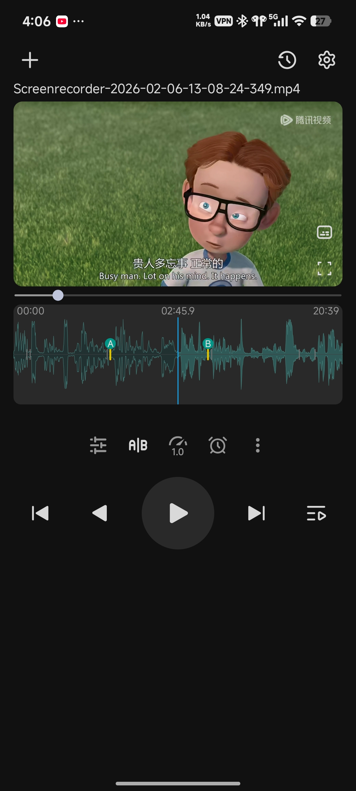
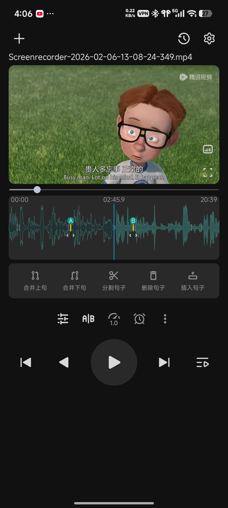
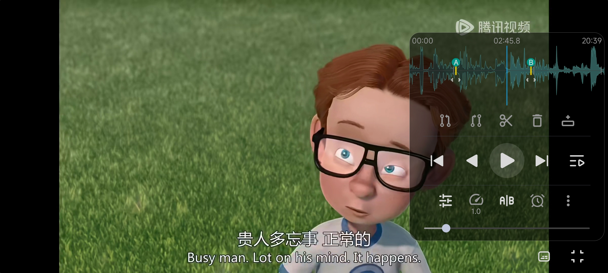

# 复读机 (LanguageRepeater)

一款专为语言学习设计的 Android 视频播放器，通过**句子级 AB 复读**帮助你高效精听影视内容。

<p align="center">
  
  &nbsp;&nbsp;
  
  &nbsp;&nbsp;
  
</p>

---

## 功能特性

### 核心功能
- **AB 复读** — 在音频波形上拖动 A/B 标记，精确设定复读区间，自动循环播放
- **智能句子分割** — 基于本地语音活动检测（VAD）算法，自动识别句子边界；也支持导入同名 `.srt` 字幕文件
- **手动句子编辑** — 支持分割、合并、插入、删除句子，精确到帧级别

### 音频波形可视化
- 实时滚动波形，播放进度线居中显示
- 波形上直观展示 A/B 标记和句子分隔线
- 支持拖动波形调整播放进度

### 播放控制
- 上一句 / 下一句切换
- 变速播放（0.5x ~ 2.0x）
- 定时关闭（10 / 20 / 30 / 45 / 60 分钟，或播完当前视频）
- 耳机/蓝牙按键控制上下句切换
- 后台播放 + 系统通知栏控制

### 手势操作
| 手势 | 功能 |
|------|------|
| 单击画面 | 暂停 / 播放 |
| 双击画面 | 回到当前句开头 |
| 左右快速滑动 | 切换上一句 / 下一句 |
| 长按画面 | 倍速播放 |
| 左侧上下滑动 | 调节亮度 |
| 右侧上下滑动 | 调节音量 |

### 其他
- 横屏模式：视频全屏，控制栏浮于右侧
- 播放列表与历史记录管理，自动恢复上次播放位置
- 暗色模式支持

---

## 截图说明

| 竖屏播放 | 句子编辑 | 横屏模式 |
|----------|----------|----------|
| 波形 + A/B 标记 + 播控按钮 | 合并/分割/插入/删除句子 | 全屏视频 + 浮动控制栏 |

---

## 技术栈

| 类别 | 技术 |
|------|------|
| 语言 | Kotlin |
| 媒体播放 | Media3 (ExoPlayer) + MediaSessionService |
| 音视频处理 | FFmpegKit（提取 PCM 用于句子检测） |
| 本地数据库 | Room |
| 数据存储 | DataStore |
| 图片加载 | Coil 3 |
| 架构 | MVVM + StateFlow + Repository |
| 导航 | Navigation Component |
| UI | Material 3 + ViewBinding |

---

## 环境要求

- Android 7.0（API 24）及以上
- 推荐使用外部存储中的本地视频文件

---

## 构建

```bash
git clone https://github.com/your-username/LanguageRepeater.git
```

用 Android Studio 打开项目，同步 Gradle 后直接运行即可。

---

## 使用方法

1. 点击右上角 **+** 添加本地视频文件
2. 视频加载后，App 会自动提取音频并分析句子边界
3. 在波形上拖动 **A / B** 标记设定复读区间
4. 点击播放，开始句子级循环精听
5. 若自动分割效果不理想，点击 **A|B** 按钮进入编辑模式手动调整

---

## License

[MIT](LICENSE)
